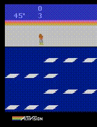
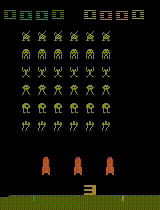

# Deep GA

We train a convolutional neural network to play two Atari 2600 games from the Arcade Learning Environment, *Space Invaders* and *Frostbite*. The model, as in DQN, receives raw pixels in input and outputs action values. However, differently from DQN and other popular approaches, it is trained with a gradient-free, population-based method belonging to the family of genetic algorithms, which allows us to achieve interesting results after training the network on a single desktop and with CPU only.

See [report.pdf](report.pdf) for details and [src](src) for the implementation.